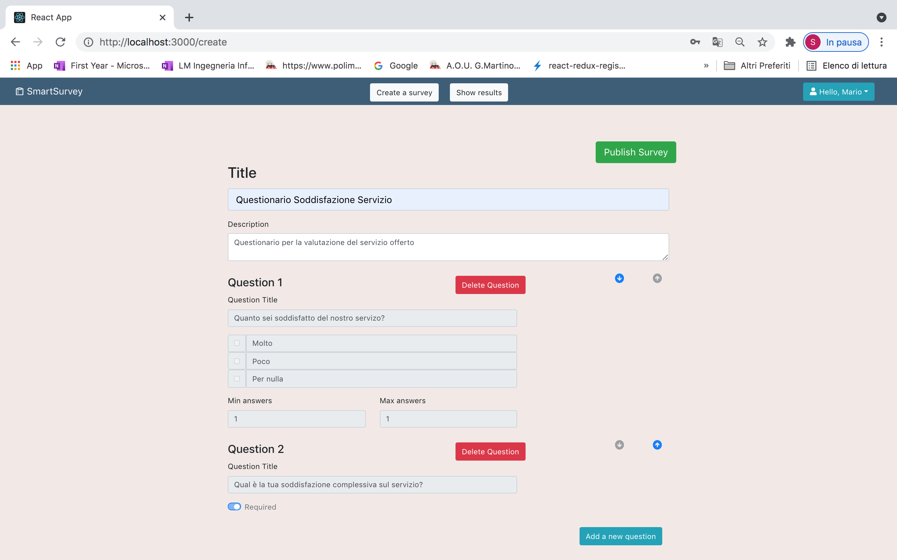

# Exam: "Survey"
## Student: CATALANO SOFIA

## React Client Application Routes

- Route `/surveys`: the main page that shows:
  1. The list of an administrator's surveys if he is logged in. For each surveys there is the number of submissions and a button in order to see the results of the survey;
  2. The list of all the surveys for the utilizator. For each survey there is a button in order to compile it.
- Route `/login`: login page for utilizators
- Route `/create`: page for the creation of a survey. It shows the form used by an administrator in order to create his survey.
- Route `/survey/:id/submission`: page that allow an utilizator to compile a specific survey. It shows the form with all the questions. The param "id" is the identification of the survey.
- Route `/results`: page that allow an administator to see the results of a survey. This page shows all the submissions and it is possible to move through them with 2 arrows.

## API Server

- POST `/api/sessions`
  - Description: authenticate the user who is trying to login
  - request body content: credentials of the user who is trying to login
    {
    "username": "username",
    "password": "password"
    }
  - response body content: authenticated user
    {
    "id": 1,
    "username": "mario.rossi@polito.it", 
    "name": "Mario"
    }
  - Response: 200 OK (success)
  - Error responses: 
      500 Internal Server Error (generic error), 
      401 Unauthorized User (login failed)

- POST `/api/sessions/current`
  - Description: check if current user is logged in and get his data
  - request body content: None
  - response body content: authenticated user
    {
    "id": 1,
    "username": "mario.rossi@polito.it", 
    "name": "Mario"
    }
  - Response: 200 OK (success)
  - Error responses: 
      500 Internal Server Error (generic error), 
      401 Unauthorized User (user is not logged in)

- POST `/api/sessions/current`
  - Description: logout current user
  - request body content: None
  - response body content: None
  - Response: 200 OK (success)
  - Error responses: 
      500 Internal Server Error (generic error), 
      401 Unauthorized User (user is not logged in)

- GET `/api/admins/id/surveys`
  - Description: get all the surveys of an admin by his userId
  - request parameters: id of the user
  - response body content: list of the admin's surveys.
  [
    { "id": 1,
      title: 'Questionario1',
      description: 'descrizione questionario 1',
      numSubmissions: 4
    },
    { id: 2,
      title: 'Questionario2',
      description: '',
      numSubmissions: 0 
    }
  ]
  - Response: 200 OK (success)
  - Error responses: 
      500 Internal Server Error (generic error), 
      400 Bad Request

- GET `/api/surveys/users`
  - Description: get the last userId of the utilizator that compiles the survey
  - response body content: last userId
  - Response: 200 OK (success)
  - Error responses: 
      500 Internal Server Error (generic error)

- GET `/api/surveys/:id/submissions`
  - Description: get all the submissions of the survey identified by its id
  - request parameters: id of the survey
  - response body content: list of the submission (for each utilizator, the list of open and close answers.)
  [
    {
      idUser: 1,
      name: 'Sofia',
      closeAnswers: [
        {
          questionId: 1,
          title: 'Quale frutta ti piace?',
          position: 1,
          value: 1,
          choiceId: 255,
          text: 'Fragola'
        }, 
        {
          questionId: 1,
          title: 'Quale frutta ti piace?',
          position: 1,
          value: 0,
          choiceId: 256,
          text: 'Banana'
        },
        {
          questionId: 1,
          title: 'Quale frutta ti piace?',
          position: 1,
          value: 0,
          choiceId: 256,
          text: 'Lampone'
        },
        {
          questionId: 2,
          title: 'Quale strumento musicale ti piace?',
          position: 2,
          value: 1,
          choiceId: 255,
          text: 'Chitarra'
        }, 
        {
          questionId: 2,
          title: 'Quale strumento musicale ti piace?',
          position: 2,
          value: 0,
          choiceId: 256,
          text: 'Pianoforte'
        },
        {
          questionId: 2,
          title: 'Quale strumento musicale ti piace?',
          position: 2,
          value: 0,
          choiceId: 256,
          text: 'Violino'
        }

    {
      ],
      openAnswers: [ 
        {
          questionId: 3,
          title: 'Scrivi la tua frutta preferita',
          position: 3,
          text: 'Mi piace la fragola'
        },
        { questionId: 4,
          title: 'Scrivi il tuo posto preferito',
          position: 4,
          text: 'Montagna' }]
    },
    {
      idUser: 2,
      name: 'Mario',
      closeAnswers: [
        [Object], [Object],
        [Object], [Object],
        [Object], [Object],
        [Object], [Object],
        [Object], [Object]
      ],
      openAnswers: [ [Object] ]
    },
      {
      idUser: 3,
      name: 'Luigi',
      closeAnswers: [
        [Object], [Object],
        [Object], [Object],
        [Object], [Object],
        [Object], [Object],
        [Object], [Object]
      ],
      openAnswers: [ [Object] ]
    },
  ]
  - Response: 200 OK (success)
  - Error responses: 
      500 Internal Server Error (generic error), 
      422 Unprocessable Entity (values do not satisfy validators)

- GET `/api/surveys/:id`
  - Description: get the full list of questions of a survey identified by its id 
  - request parameters: id of the survey
  - response body content: full list of questions.
    "content" represents the list of all the possible choices for a question.
    if it is an open question, content is empty.
[
  {
    questionId: 1,
    title: 'Quesito 1',
    min: 0,
    max: 1,
    survey: 1,
    position: 1,
    content:
    [
      { id: 1, question: 1, text: 'Option 1' },
      { id: 1, question: 1, text: 'Option 2' },
      { id: 1, question: 1, text: 'Option 3' },
      { id: 1, question: 1, text: 'Option 4' }
    ]
  },
  {
    questionId: 2,
    title: 'Quesito 2',
    min: 0,
    max: 1,
    survey: 1,
    position: 2,
    content: [ [Object], [Object], [Object] ]
  },
  {
    questionId: 3,
    title: 'Quesito 3',
    min: 1,
    max: 1,
    survey: 1,
    position: 3,
    content: [ [Object], [Object], [Object] ]
  },
  {
    questionId: 4,
    title: 'Quesito 4',
    min: 1,
    max: 0,
    survey: 1,
    position: 4,
    content: []
  }
]
  - Response: 200 OK (success)
  - Error responses: 
      500 Internal Server Error (generic error), 
      400 Bad Request

- GET `/api/surveys`
  - Description: get the full list of surveys
  - request parameters: None
  - response body content: full list of surveys
  [
    { id: 1,
      title: 'Questionario1',
      description: 'descrizione del questionario 1',
      admin: 1
    },
    { id: 2, 
      title: 'Questionario2',
      description: 'descrizione del questionario 2',
      admin: 2
    },
    { id: 3, 
      title: 'Questionari32',
      description: 'descrizione del questionario 3',
      admin: 1
    },
]
  - Response: 200 OK (success)
  - Error responses: 
      500 Internal Server Error (generic error)

- POST `/api/surveys`
  - request parameters and request body content
  - response body content

- POST `/api/surveys`
  - Description: Add a new survey to the surveys of the logged user
  - request body content: description of the survey to add 
 {
  title: 'Questionario 1',
  description: 'Descrizione del questionario 1',
  questions: [
    {
      questionId: 1,
      title: 'Quesito 1',
      content: [Array],
      min: '1',
      max: '2',
      position: 1
    },
    {
      questionId: 2,
      title: 'Quesito 2',
      content: [],
      min: 1,
      max: 0,
      position: 2
    }
  ]
}
  - response body content: last id
  - Response: 200 OK (success)
  - Error responses: 
      500 Internal Server Error (generic error), 
      422 Unprocessable Entity (values do not satisfy validators)

## Database Tables

- Table `users` (contains the data of the admins):
 * "id" INTEGER NOT NULL
 * "email" TEXT NOT NULL
 * "name" TEXT NOT NULL
 * "hash" TEXT NOT NULL
  PRIMARY KEY("id") 

- Table `surveys`(contains the data of the surveys):
  * "id" INTEGER NOT NULL
  * "title" TEXT NOT NULL
  * "description" TEXT
  * "admin" TEXT NOT NULL
  * "numSubmissions" INTEGER NOT NULL
  * "admin" INTEGER NOT NULL
    FOREIGN KEY("admin") REFERENCES "users"("id")
	  PRIMARY KEY("id")

- Table `questions` (contains the data of the open and closequestions):
  * "id" INTEGER NOT NULL
  * "title" TEXT NOT NULL
  * "min"	INTEGER NOT NULL
  * "max"	INTEGER NOT NULL,
	* "survey" INTEGER NOT NULL,
	* "position" INTEGER NOT NULL,
    FOREIGN KEY("survey") REFERENCES "surveys"("id")
	  PRIMARY KEY("id")

- Table `choices` (contains all the choices related to the open questions):
  * "id" INTEGER NOT NULL
  * "question" INTEGER NOT NULL
  * "text" TEXT NOT NULL
    FOREIGN KEY("question") REFERENCES "questions"("id")
	  PRIMARY KEY("id")

- Table `openAnswers` (contains the answers of the users related to the close questions):
  * "idUser" INTEGER NOT NULL
  * "question" INTEGER NOT NULL
  * "text" TEXT NOT NULL
  * "name" TEXT NOT NULL
    FOREIGN KEY("idUser") REFERENCES "users"("id"),
    FOREIGN KEY("question") REFERENCES "questions"("id")
	  PRIMARY KEY("idUser, question")

- Table `closeAnswers` (contains the answers of the users related to the open questions):
  * "idUser" INTEGER NOT NULL
  * "choice" INTEGER NOT NULL
  * "value" INTEGER NOT NULL
  * "name" TEXT NOT NULL
    FOREIGN KEY("idUser") REFERENCES "users"("id"),
    FOREIGN KEY("choice") REFERENCES "choices"("id")
	  PRIMARY KEY("idUser, choice")

## Main React Components

- `CreationForm` (in `CreationComponent.js`): component that allow an administrator to create a new survey.
  It shows: 
  * the form to create a survey.
  It uses 2 minor components `OpenQuestion` and `CloseQuestion` to handle the 2 types of questions. 

- `SurveysList` (in `SurveysListComponent.js`): component that allow an administrator/utilizator to see the list of surveys.
  It shows:
    * for the administrator: the list of his surveys. For each survey, there is the number of utilizators that fill in it and a button to see the results.
    * for the utilizator: the full list of surveys. For each survey there is a button to compile it. 

- `Submission` (in `Submission`): component that allow an utilizator to compile the survey. 
  It shows:
    * the title of the survey, a label to insert the name, the list of all the questions of the survey in order to compile them and a button to submit. 

- `SubmissionsList` (in `SubmissionsListComponent.js`):component that allow an administrator to see the result of a survey.  
  It shows:
    * the submission of the first utilizator. It is possible to move through the different submissions with 2 arrows.
  It uses the component `Submission` to show the submissions. 

- `LoginForm` (in `LoginComponents.js`):component that allow an administrator to log in.  
  It shows:
    * the login form with 2 fields: username and password. 

- `NavBar` (in `NavbarComponent.js`):component that represents the navbar of the application. It also allow an administrator to login, create and show the results of a survey.  
  It shows:
    * the name of the application, a button to login and if 2 buttons to create and to show results (if logged in)

## Screenshot

## Users Credentials

- username: mario.rossi@polito.it, password: Password1 
 * Surveys:
  1. `Sondaggio sulle tendenze della moda e sul comportamento dei consumatori`
  2. `Indagine sulla Qualità del monopattino air s- Ibike`

- username: luigi.bianchi@polito.it, password: Password2 
 * Surveys:
  1. `Questionario Soddisfazione Servizio`
  2. `Feedback dai Clienti Ristorante "Bamboo"`
